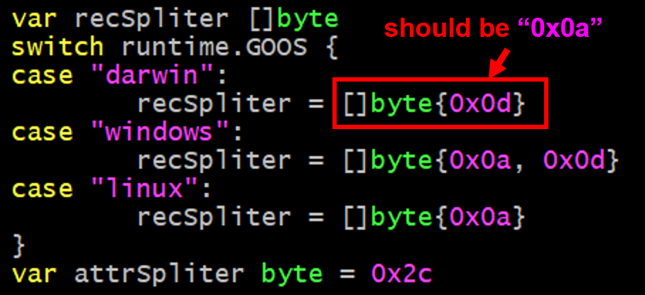
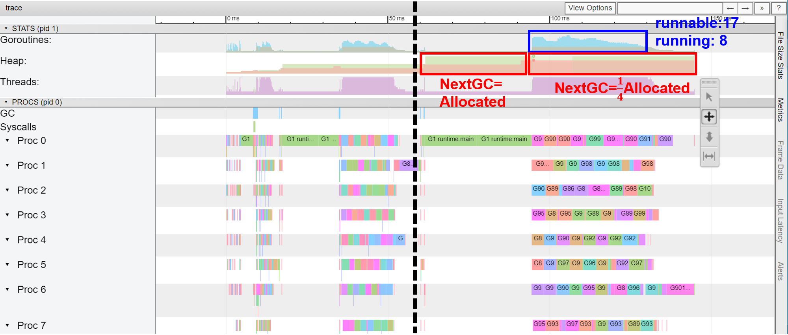

# 1. Week 4正确性
因为读文件采取的方式是以\[\]byte读出来，再遍历\[\]byte，根据**recSpliter**把\[\]byte切分成一条一条的**records**。之前在初始化**chunkReader**的时候不小心把mac的**recSpliter**写成了`\r`, 实际应该是`\n`。

在`join.go`的`hashJoin.init`函数中：

# 2. go tool trace对goroutine的分析 
> Week4 -- Join

从上图来看，基本上开了的goroutine都被用上了，也较少发生GC，运行情况比较正常。

> Week2 -- MapReduce

MapReduce的`trace.out`好像没有采集到任何信息，因为**runnable**的goroutine才只有3个。于是用pprof来每隔1s采集goroutine的数目，增加的代码片段如下：

得到的结果如下，从输出结果来看，程序的运行大致是正常的，因为第一轮的nMap为60，第二轮的nMap为nCPU(测试环境为8)。

> Week1 -- MergeSort

从上图来看，在某段期间，goroutine有一半都被阻塞的，因为测试环境只有8个线程，能并发的最多只有8个goroutine，而实际为了减小底层调用**sort.Slice**进行排序的数据规模，故意开了16个goroutine，从pprof CPU的结果来看，时间反而比开8个goroutine的短。

从内存分配的角度，因为预分配了一个**backup**数组用于**merge**，所以刚开始的时候**NextGC=Allocated**，后来运行的时候NextGC变成了Allocated的1/4，说明backup数组只有一半被用到了(不知道为什么会这样，其实我觉得NextGC应该为0...)

