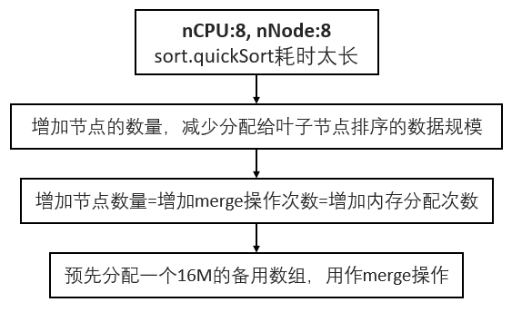

# 1. Idea
基本思路如下图所示：
1. 中间节点从父节点收到自己负责的数据块后，将数据块一分为二，自己负责左半部分数据块的排序，将右半部分分给儿子节点；
2. 如此递归下去，直到叶子节点，叶子节点采用golang sort包提供的sort函数对数据块进行排序；
3. 当儿子节点完成自己负责的数据块排序后，父节点再对左右两个数据块进行merge操作。merge行为的协同由wg.waitGroup来实现；

# 2. PProf
基本优化思路如下图所示。因内存占用情况和routine race的情况都正常，所以下面只分析了CPU Profile的结果。

> **Phase 1**: node的数量=CPU的数量，每次merge操作临时开辟内存

我的电脑是8线程的，有8个node参加了底层的sort.quickSort排序，相当于每个sort.quickSort的数据规模是2M，2048个整数。CPU Profile的结果如下图所示，可以看到在quickSort的doPivot阶段花了相当一部分时间，于是想增加叶子节点，减小每个叶子节点排序的数据规模，以减少doPivot花费的时间。

> **Phase 2**：node的数量=n\*CPU的数量

在8线程，16GB RAM的电脑上，分别尝试node数量为8, 16, 32, 64, 128的情况，发现64是一个凹点（此时每个node要排256个数据）, CPU Profile输出的结果如下图所示。可以看出quickSort的时间减少了100ms, 但在runtime.systemstack上的时间却增多了，多出来的这些时间又大多在内存分配上。故想办法减少内存的分配次数。

> **Phase 3**: node的数量=n\*CPU的数量，预分配用于merge的备用数组

为了避免merge结果的拷贝，将merge数组和存放源数据的数组src交替使用，最终得到的CPU Profile的输出结果如下，可以看到runtime.systemstack的开销已大大降低。

